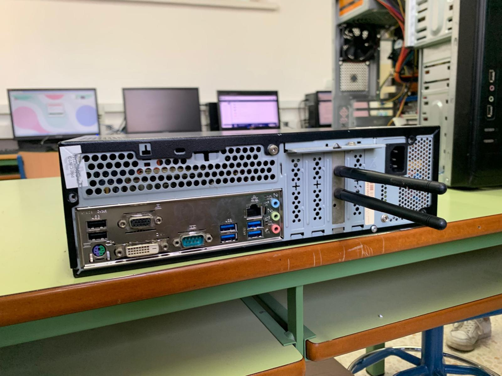

# **PARTES DE UN ORDENADOR**

## MONTAJE Y DESMONTAJE

### PARA EL DESMONTAJE DE ESTE EQUIPO ANTIGUO PRIMERO VAMOS A DEJAR COMO DATO LAS CARACTERISTICAS DE ESTE SIGUIENTE :

#### ·Modelo de placa base : GIGABYTE GA-H8
#### ·Procesador : Intel pentium 4 (3 GHz)
#### ·Cantidad de memoria RAM : 3 Gb de memoria 
#### ·Unidad de almacenamiento : Disco duro de 500 Gb ( de la marca Western Digital)
#### ·Disipador : intel E97379-001
#### ·Tarjeta de red : TP-Link TL-WN881ND

### MANTENIMIENTO Y DESMONTAJE
