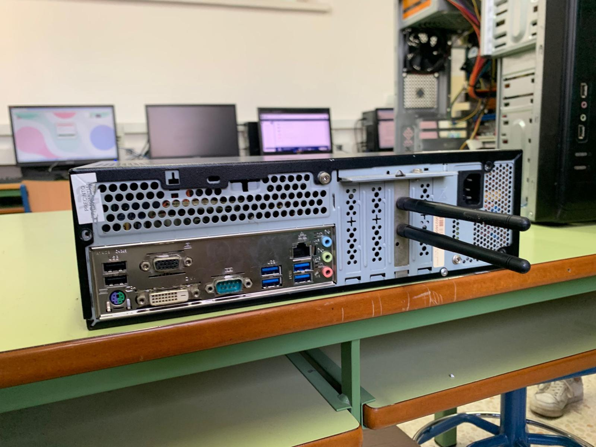
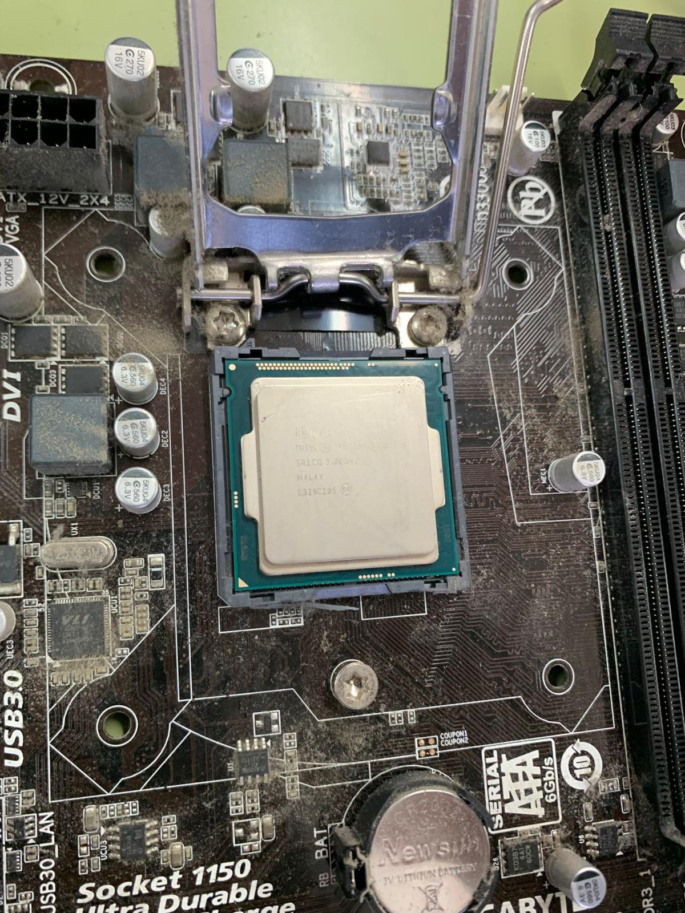
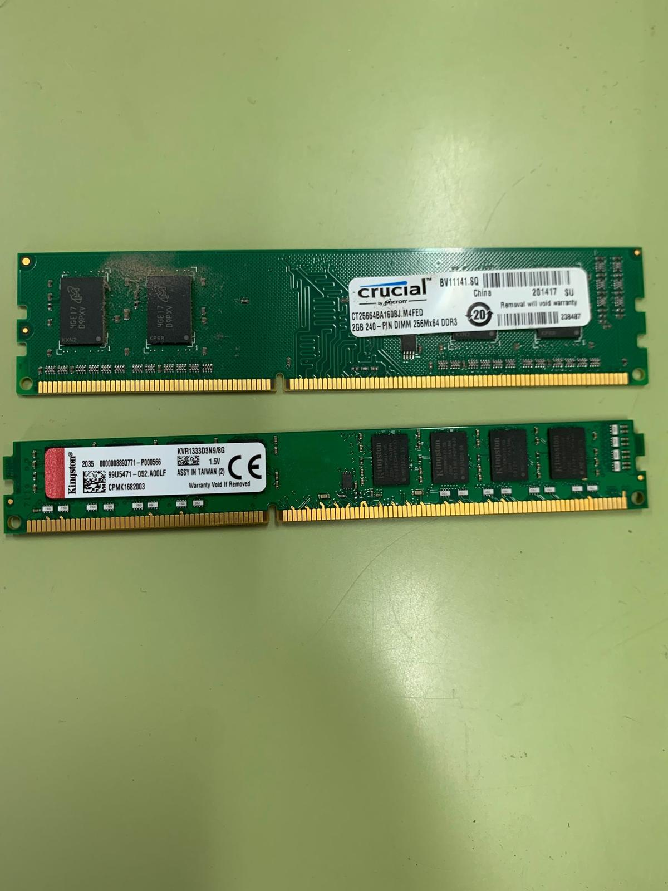
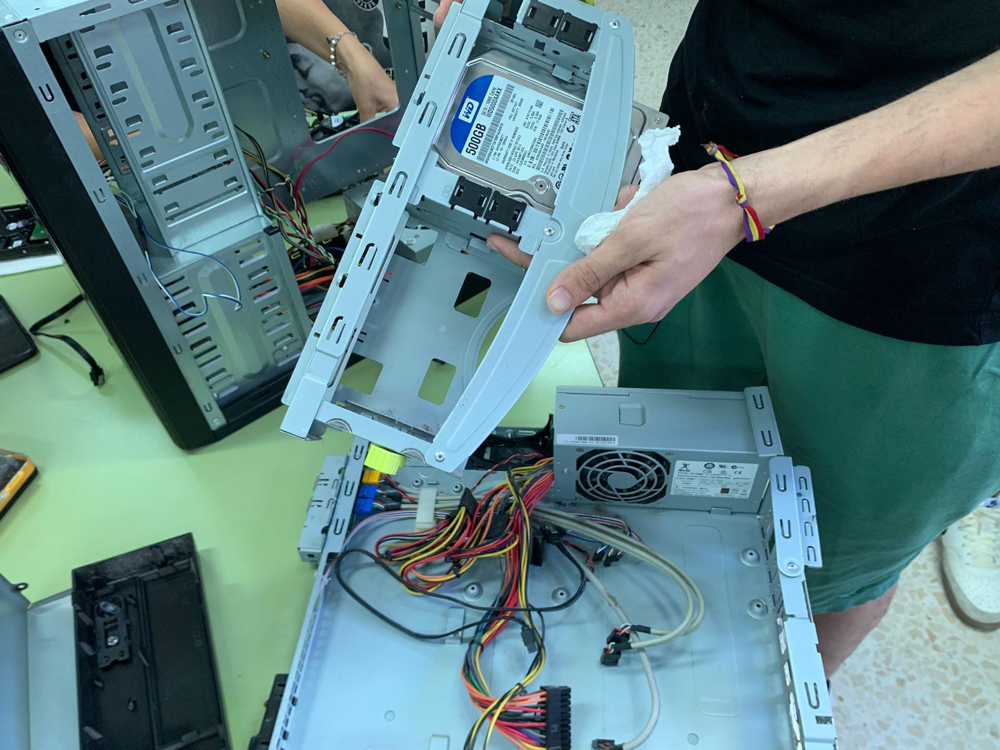
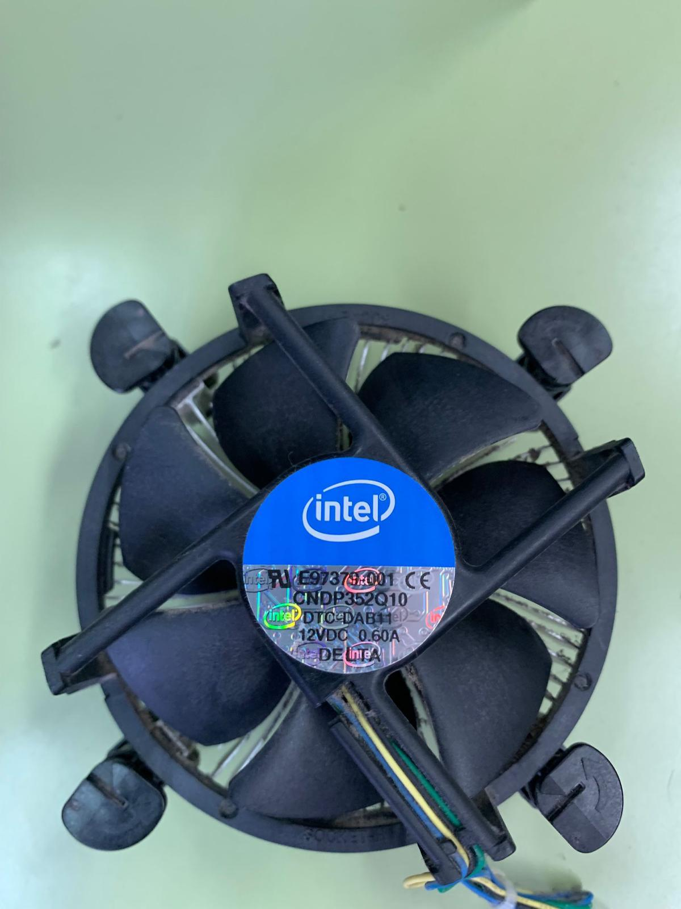
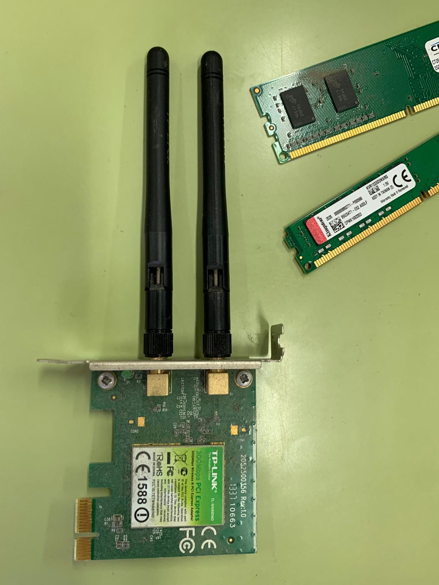

# **PARTES DE UN ORDENADOR**

## MONTAJE Y DESMONTAJE

## PARA EL DESMONTAJE DE ESTE EQUIPO ANTIGUO PRIMERO VAMOS A DEJAR COMO DATO LAS CARACTERISTICAS DE ESTE SIGUIENTE :
| Placa base  | Procesador | Memoria RAM  | Unidad de Almacenamiento | Disipador | Tarjeta de red |
| ----------- | ---------- | ------------ | ------------------------ |-----------|----------------|
| GIGABYTE GA-H8 | Intel pentium 4 (3 GHz)  |  10 Gb de memoria RAM  | Disco duro de 500 Gb  | intel E97379-001 | TP-Link TL-WN881ND |

#### ·Modelo de placa base : GIGABYTE GA-H8

#### ·Procesador : Intel pentium 4 (3 GHz)

#### ·Cantidad de memoria RAM : 10 Gb de memoria

#### ·Unidad de almacenamiento : Disco duro de 500 Gb ( de la marca Western Digital)

#### ·Disipador : intel E97379-001

#### ·Tarjeta de red : TP-Link TL-WN881ND

## MANTENIMIENTO Y DESMONTAJE

