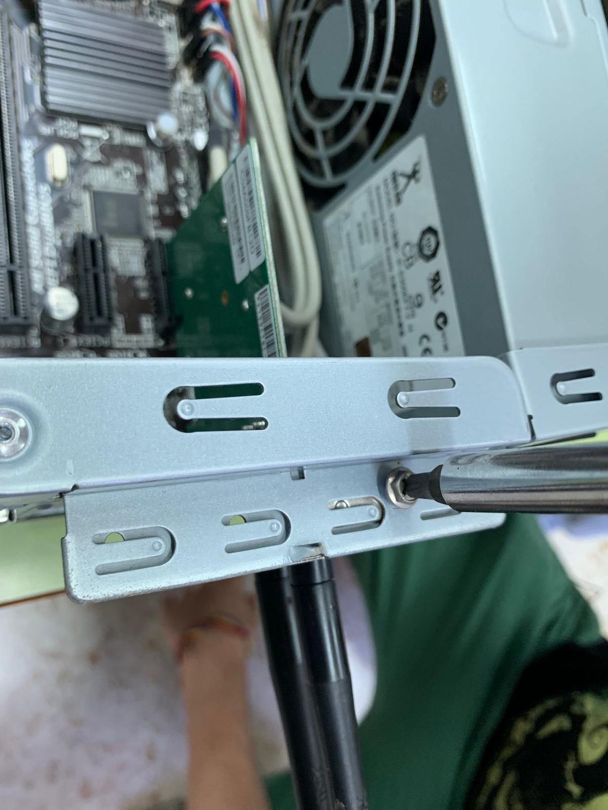

# **PARTES DE UN ORDENADOR**

## MONTAJE Y DESMONTAJE

## PARA EL DESMONTAJE DE ESTE EQUIPO ANTIGUO PRIMERO VAMOS A DEJAR COMO DATO LAS CARACTERISTICAS DE ESTE SIGUIENTE :
| Placa base  | Procesador | Memoria RAM  | Unidad de Almacenamiento | Disipador | Tarjeta de red |
| ----------- | ---------- | ------------ | ------------------------ |-----------|----------------|
| GIGABYTE GA-H8 | Intel pentium 4 (3 GHz)  |  10 Gb de memoria RAM  | Disco duro de 500 Gb  | intel E97379-001 | TP-Link TL-WN881ND |

#### ·Modelo de placa base : GIGABYTE GA-H8

#### ·Procesador : Intel pentium 4 (3 GHz)

#### ·Cantidad de memoria RAM : 10 Gb de memoria

#### ·Unidad de almacenamiento : Disco duro de 500 Gb ( de la marca Western Digital)

#### ·Disipador : intel E97379-001

#### ·Tarjeta de red : TP-Link TL-WN881ND

## MANTENIMIENTO Y DESMONTAJE

#### ·Paso 1 : Desatornillar la tapa del gabinete .

#### ·Paso 2 : Desanclar todos los componentes que viene atornillados al gabinete  .

#### ·Paso 3 : Revisamos por encima de manera general la placa madre conectores y componentes visibles (por si alguno está mal conectado o está cubierto de polvo) 

#### ·Paso 4 : Retiramos los conectores de la placa madre (importante visualizar los pines de donde se coloca cada uno de estos para posteriormente volver a montarlos)

#### ·Paso 5 : Todo desconectado , desanclamos la placa base del gabinete .

#### ·Paso 6 : Retiramos y revisamos el estado de los modulos de memoria RAM (por si están dañados o tienen polvo )

#### ·Paso 7 : Retiramos el disipador de la cpu y realizamos una revisión y limpieza (ya que esta componente se suele llenar de polvo )

#### ·Paso 8 : Retiramos la cpu del zócalo realizamos una revisión y cambiamos la pasta termica antigua (por si a lo mejor el zócalo o socket está dañado o por si la pasta termica está seca)

